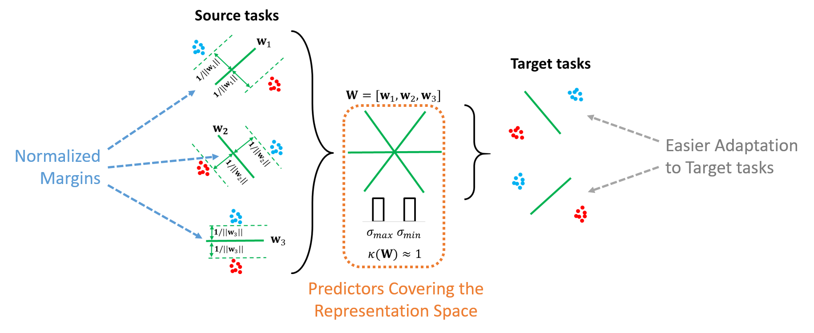

# MetaMTReg
Official code for "Improving Few-Shot Learning through Multi-task Representation Learning Theory" ECCV 2022.



## How to run

### Install required packages

You can run `pip install -r requirements.txt` to install required packages or `conda env create -f environment.yml` to create a new environment with the required packages installed.

### Train MAML:

Train MAML with the script `train_maml.sh`. Add arguments `--s_ratio` *and* `--s_norm` to train with the regularization.

### Train ProtoNet:

Train ProtoNet with the script `train_proto.sh`. Add arguments `--norm` to train with normalized prototypes.

### Evaluate:

Evaluate MAML or ProtoNet with the script `eval.sh`.  
For Cross-dataset evaluation, change the argument `--dataset`. However, you will need to download and create your own Dataset class. In the folder `datasets` you can find the code for CropDisease, but you need to download the dataset manually.

# License

This repository is released under the [CeCILL](LICENSE.txt) license, a free software license
adapted to both international and French legal matters that is fully compatible
with the FSF's GNU/GPL license.

# Citation

If you find this repository useful for your own work, please cite our paper:
```BibTeX
@InProceedings{Bouniot2022improving,
  author = {Bouniot, Quentin and Redko, Ievgen, and Audigier, Romaric and Loesch, Angélique and Habrard, Amaury},
  title = {Improving Few-Shot Learning through Multi-task Representation Learning Theory},
  booktitle = {European Conference on Computer Vision},
  year = {2022}
}
```